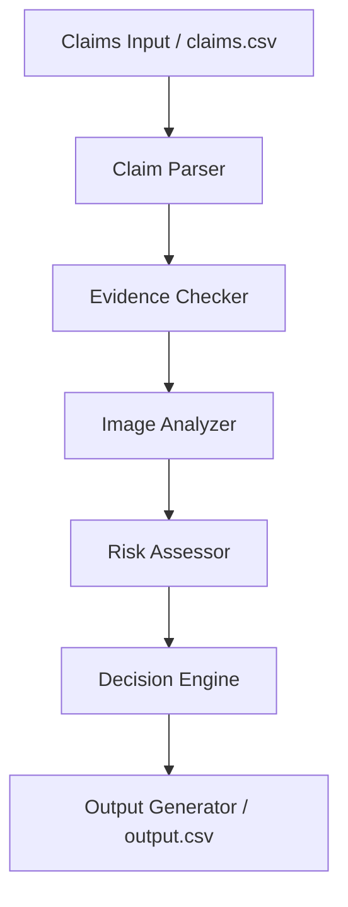

# Multi-Modal Evidence Review System

This repository contains a production-ready, modular AI system that verifies insurance-style damage claims using submitted images, claim conversations, risk history profiles, and evidence rules.

The core design prioritizes visual evidence as the primary source of truth. User history adds contextual metadata but never overrides visual facts.

---

## 1. Project Overview and Objective

The goal of this system is to automatically evaluate customer claims across three main object types:
* **Cars** (e.g., front_bumper, side_mirror, door)
* **Laptops** (e.g., screen, keyboard, hinge)
* **Packages** (e.g., box, seal, contents)

For each claim, the system evaluates:
1. **Claim Understanding**: What damage is reported on which part?
2. **Evidence Standards**: Do the submitted images meet the minimum evidence required by the claims policy?
3. **Multi-Image Quality and Damage Detection**: Are the images blurry? Is the correct object and part visible? Is there actual damage?
4. **Contextual Risk**: Does the customer have a history of frequent rejections or manual reviews?
5. **Deterministic Decision**: Is the claim **supported**, **contradicted**, or does it contain **not enough information** to evaluate?

---

## 2. System Architecture

The pipeline processes each claim sequentially through the following modules:



### Module Breakdown
* **Claim Parser (`src/claim_parser.py`)**: Normalizes conversations into semantic labels (`issue_type`, `object_part`, and `issue_family`).
* **Evidence Checker (`src/evidence_checker.py`)**: Matches claims against policy requirements inside `evidence_requirements.csv`.
* **Image Analyzer (`src/image_analyzer.py`)**: Executes OpenCV visual quality checks (variance of Laplacian for blur, pixel brightness statistics for glare/low-light) and handles multi-modal model analysis (via Gemini, OpenAI, or Mock).
* **Risk Assessor (`src/risk_assessor.py`)**: Loads `user_history.csv` to flag anomalies.
* **Decision Engine (`src/decision_engine.py`)**: Determines final status (`supported`, `contradicted`, `not_enough_information`) using rule-based decision trees.
* **Output Generator (`src/output_generator.py`)**: Compiles fields and saves results into `output.csv`.

---

## 3. Setup and Installation

### Prerequisites
* Python 3.11+

### Installation
From the root directory containing the `code/` folder:

```bash
pip install -r code/requirements.txt
```

---

## 4. How to Run

The main script provides arguments to run the verification engine, execute evaluation tasks, and configure providers.

### Running Verification on Claims CSV
Run the claims processor on the test set:
```bash
python code/main.py --claims-file dataset/claims.csv --output-file output.csv --vision-provider mock
```

### Running the Evaluation Pipeline
To calculate metrics on the sample claims dataset:
```bash
python code/evaluation/main.py --run-evaluation --sample-claims-file dataset/sample_claims.csv --vision-provider mock
```
This writes evaluation metrics and reports under the `code/evaluation/` directory:
* `code/evaluation/metrics.json`
* `code/evaluation/confusion_matrix.csv`
* `code/evaluation/sample_predictions.csv`
* `code/evaluation/evaluation_report.md`

---

## 5. Switching Model Providers

The system defines a pluggable adapter client (`BaseVisionModel` in `src/models.py`). You can swap adapters using CLI arguments:

### 1. Mock Mode (Default)
Runs fully offline using local image heuristics and sample mappings. Useful for test suites and development.
```bash
python code/main.py --vision-provider mock
```

### 2. Gemini API
Uses Gemini 2.5 Flash for multimodal parsing and verification.
1. Export your API key:
   ```bash
   # Unix
   export GEMINI_API_KEY="your-key"
   # Windows PowerShell
   $env:GEMINI_API_KEY="your-key"
   ```
2. Run the main file:
   ```bash
   python code/main.py --vision-provider gemini
   ```

### 3. OpenAI API
Uses GPT-4o for visual checks.
1. Export your API key:
   ```bash
   # Unix
   export OPENAI_API_KEY="your-key"
   # Windows PowerShell
   $env:OPENAI_API_KEY="your-key"
   ```
2. Run the main file:
   ```bash
   python code/main.py --vision-provider openai
   ```

---

## 6. Dataset Schema Specifications

### Input Claims (`dataset/claims.csv`)
* `user_id`: Unique identifier for the claimant
* `image_paths`: Semicolon-separated path strings
* `user_claim`: Conversation dialogue text
* `claim_object`: `car` | `laptop` | `package`

### User History (`dataset/user_history.csv`)
* `user_id`: Customer identifier
* `past_claim_count`: Total claims filed
* `accept_claim`: Supported claims count
* `manual_review_claim`: Manual review flags count
* `rejected_claim`: Contradicted/rejected claims count
* `last_90_days_claim_count`: Claims in recent 90 days
* `history_flags`: Semicolon-separated tags (e.g. `user_history_risk;manual_review_required`)
* `history_summary`: Text summary of risk profile

---

## 7. Limitations & Production Guidelines

### Limitations
1. **API Key Dependency**: Live validation requires model keys. When unset, the system falls back gracefully to Mock Mode.
2. **Local Heuristics**: Blurriness detection assumes a default Laplacian threshold which may flag images with shallow depth-of-field as blurry.

### Production Best Practices
* **Rate Limits (RPM/TPM)**: Paid API tiers should be used for concurrency. For free tiers, sequential processing with a 4.0-second delay is recommended.
* **Batching**: When processing thousands of claims, run the process in batches using a message queue (e.g., Celery + RabbitMQ) to allow asynchronous, retry-safe executions.
* **Caching**: Cache prompt templates and image inputs to reduce duplicate requests and model token usage.
